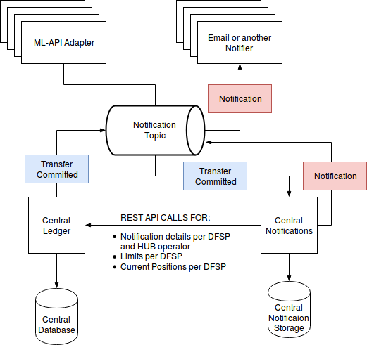
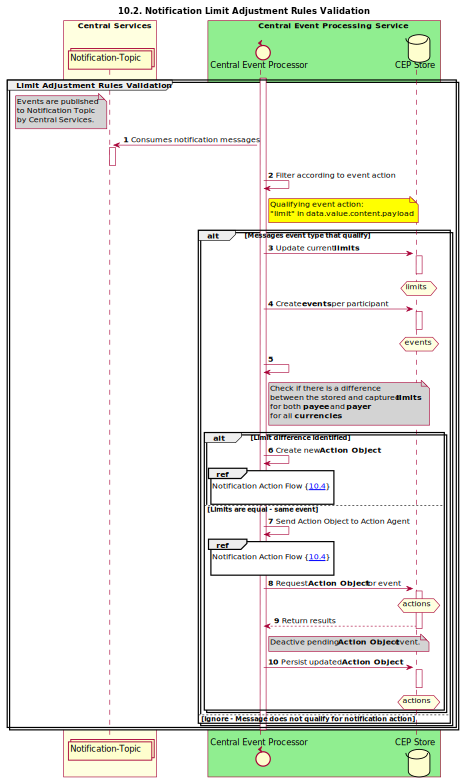
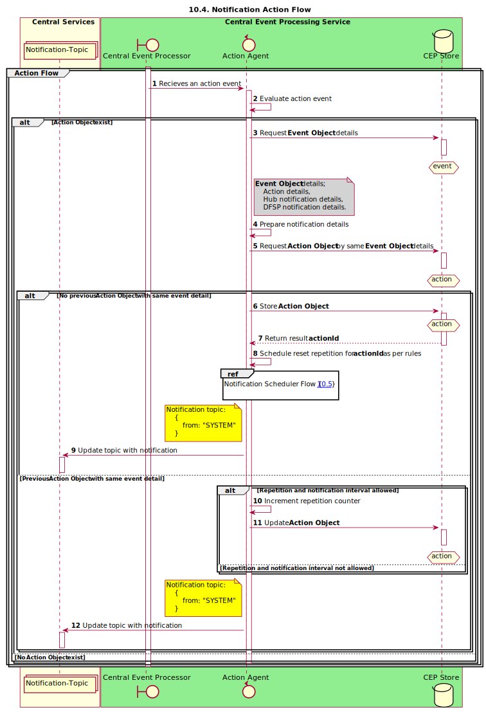
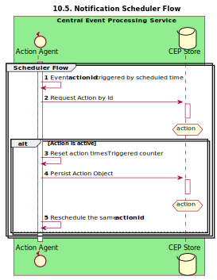

# Notification service
[](https://github.com/mojaloop/central-event-processor/commits/master)
[](https://github.com/mojaloop/central-event-processor/releases)
[](https://hub.docker.com/r/mojaloop/central-event-processor)
[](https://circleci.com/gh/mojaloop/central-event-processor)

The Central Event Processor service  will provide notification(s) to participating FSPs and the Hub Operator for changes to Net Debit Cap or Position adjustments. Notification(s) are also provided for approaching the Net Debit Cap threshold that is configurable.

## Contents
* [Deployment](#1-deployment)
* [Stories](#2-stories)
* [Tasks](#3-tasks)
* [Reacts on](#4-reacts-on)
* [Used technologies](#5-used-technologies)
* [Local storage](#6-local-storage)
* [Architecture overview](#7-architecture-overview)
* [General process overview](#8-general-process-overview)
  * [enums](#81-enums)
  * [Rules](#82-rules)
  * [Config](#83-config)
* [Limit Adjustment Rules flow](#9-limit-adjustment-rules-flow)
* [Limit Position Threshold Breach flow](#10-limit-position-threshold-breach-flow)
* [Actions Agent flow](#11-actions-agent-flow)
* [Scheduler flow](#12-scheduler-flow)
* [Notifier flow (separate service)](#13-notifier-flow-separate-service)

## 1. Deployment
See the [onboarding guide](onboarding.md) for running the service locally.

## 2. Stories
### Central Event Processor

### stories

* [#517 - Notification for changes to NetDebitCap or Position adjustments](https://github.com/mojaloop/project/issues/517)
* [#518 - Notification for approaching Net Debit Cap Threshold](https://github.com/mojaloop/project/issues/518)

## 3. Tasks
* send notifications when current position breaches the limit threshold value after a successful transfer was commited
* send notifications when the limit was adjusted 
* make it extendable and flexible

## 4. Reacts on 
* messages consumed from the notification topic
* data read from the central-ledger API

## 5. Used technologies
* [RxJS](https://github.com/ReactiveX/rxjs)
* [json-rule-engine](https://github.com/cachecontrol/json-rules-engine)
* [mongoose](https://github.com/Automattic/mongoose)

## 6. Local storage
* Mongo DB
* Mongoose is used for schema validations and ORM functions
* to set up connection the following environmental variables might be used: `CEP_DATABASE_URI` and `CEP_DATABASE_NAME`
* full database documentation can be found at [Mojaloop central notifications Database](docs/database/Mojaloop_central-notifications_Db_ver1.0.html)

## 7. Architecture overview



[Architecture Overview](docs/images/1.png)

This is standalone service which is connected to Kafka Notification topic into the mojaloop environemnt and monitors the topic for messages which match certain rules and takes actions accordingly. 

The service is developed using [RxJS](https://github.com/ReactiveX/rxjs) for observing the system and acting accordingly. The decisions for actions are taken by the [json-rule-engine](https://github.com/cachecontrol/json-rules-engine). 

## 8. General process overview


[Process Overview](docs/images/2.png)

The rules validations are triggered upon commited transfers. As soon as a commited transfer notification is produced from the central-ledger to the notification topic, the central-notifications service picks it up, gathers more information, runs few rules validations and acts based on rules engine outcome.

The data for performing rules validation is requested from the central-ledger admin API calls using observables, available [here](src/observables/centralLedgerAPI.js) some mapping and wiring is done through below [enums](src/lib/enum.js) properties:

### 8.1. enums
```javascript
const notificationActionMap = {
  NET_DEBIT_CAP_THRESHOLD_BREACH_EMAIL: {
    enum: 'NET_DEBIT_CAP_THRESHOLD_BREACH_EMAIL',
    action: 'sendEmail',
    templateType: 'breach',
    language: 'en'
  },
  NET_DEBIT_CAP_ADJUSTMENT_EMAIL: {
    enum: 'NET_DEBIT_CAP_ADJUSTMENT_EMAIL',
    action: 'sendEmail',
    templateType: 'adjustment',
    language: 'en'
  }
}

const limitNotificationMap = {
  NET_DEBIT_CAP: {
    enum: 'NET_DEBIT_CAP',
    NET_DEBIT_CAP_THRESHOLD_BREACH_EMAIL: notificationActionMap.NET_DEBIT_CAP_THRESHOLD_BREACH_EMAIL,
    NET_DEBIT_CAP_ADJUSTMENT_EMAIL: notificationActionMap.NET_DEBIT_CAP_ADJUSTMENT_EMAIL
  }
}
```

### 8.2. Rules
Currently two separate Rules are validated: 
1. [Limit Adjustment Rule](src/observables/rules/ndcAdjustment.js)
2. [Limit Position Threshold Breach Rule](src/observables/rules/ndcBreach.js) 

In the current implementation for each separate rule, an observable has to be created, like the couple above, and configured when and how to trigger it into the [setup](src/setup.js)
The Rules outputs should be chained to common Action Agent.

### 8.3. Config

The default [config](config/config.json)

To use Environmental Variables for MongoDB URI and database name use: 
`CEP_MONGO_URI` and `CEP_MONGO_DATABASE`

## 9. Limit Adjustment Rules flow



[Limit Adjustment Rules flow](docs/sequenceDiagrams/seq-cep-10.2-adjustment-rule-validation.svg)

This rule is triggered on each limit response from the central-ledger admin API. 


## 10. Limit Position Threshold Breach flow


[Limit Position Threshold Breach flow](docs/sequenceDiagrams/seq-cep-10.3-breaching-threshold-percentage-limit.svg)

This rule is triggered when all data for the participants in the current transfer is received.

## 11. Actions Agent flow



[Actions Agent flow](docs/sequenceDiagrams/seq-cep-10.4-action-flow.svg)

The [Action Agent](src/observables/actions) - takes care of action preparation regrding the data from central-ledger admin API and various settings.

## 12. Scheduler flow



[Scheduler flow](docs/sequenceDiagrams/seq-cep-10.5-scheduler-flow.svg)

The scheduler coordinates the Action Object that requires to be dispatched. It would typically action a scheduled event that qualifies by insure only the prescribed number of notifications are dispatched within the set time frame defined.

## 13. Notifier flow (separate service)


[Notifier flow](docs/images/6.png)

Email notifier service is a separate app, that observes the same topic for messages with field *from* = `SYSTEM`. Its code is available in the [email-notifier](https://github.com/mojaloop/email-notifier) repository.
