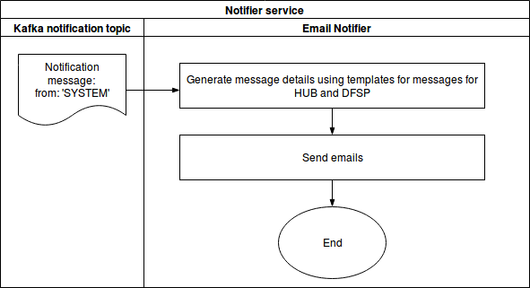

# Notification service

## Contents
<!-- vscode-markdown-toc -->
* 1. [Stories](#Stories)
* 2. [Tasks](#Tasks)
* 3. [Reacts on](#Reactson)
* 4. [Used technologies](#Usedtechnologies)
* 5. [Local storage](#Localstorage)
* 6. [Architecture overview](#Architectureoverview)
* 7. [General process overview](#Generalprocessoverview)
	* 7.1. [enums](#enums)
	* 7.2. [Rules](#Rules)
  * 7.3  [Config](#Config)
* 8. [Limit Adjustment Rules flow](#LimitAdjustmentRulesflow)
* 9. [Limit Position Threshold Breach flow](#LimitPositionThresholdBreachflow)
* 10. [Actions Agent flow](#ActionsAgentflow)
* 11. [Notifier flow (separate service)](#Notifierflowseparateservice)

<!-- vscode-markdown-toc-config
	numbering=true
	autoSave=true
	/vscode-markdown-toc-config -->
<!-- /vscode-markdown-toc -->

##  1. <a name='Stories'></a>Stories

Central Event Processor
=======================

stories
-------

* [#517 - Notification for changes to NetDebitCap or Position adjustments](https://github.com/mojaloop/project/issues/517)
* [#518 - Notification for approaching Net Debit Cap Threshold](https://github.com/mojaloop/project/issues/518)

##  2. <a name='Tasks'></a>Tasks
* send notifications when current position breaches the limit threshold value after a successful transfer was commited
* send notifications when the limit was adjusted 
* make it extendable and flexible

##  3. <a name='Reactson'></a>Reacts on 
* messages consumed from the notification topic
* data read from the central-ledger API

##  4. <a name='Usedtechnologies'></a>Used technologies
* [RxJS](https://github.com/ReactiveX/rxjs)
* [json-rule-engine](https://github.com/cachecontrol/json-rules-engine)
* [mongoose](https://github.com/Automattic/mongoose)

##  5. <a name='Localstorage'></a>Local storage
* Mongo DB
* Mongoose is used for schema validations and ORM functions
* to set up connection the following environmental variables might be used: `CEP_DATABASE_URI` and `CEP_DATABASE_NAME`
* full database documentation can be found [here](docs/database/Mojaloop_central-notifications_Db_ver1.0.html)

##  6. <a name='Architectureoverview'></a>Architecture overview


This is standalone service which is connected to Kafka Notification topic into the mojaloop environemnt and monitors the topic for messages which match certain rules and takes actions accordingly. 

The service is developed using [RxJS](https://github.com/ReactiveX/rxjs) for observing the system and acting accordingly. The decissions for actions are taken by the [json-rule-engine](https://github.com/cachecontrol/json-rules-engine). 

##  7. <a name='Generalprocessoverview'></a>General process overview


The rules validations are triggered upon commited transfers. As soon as a commited transfer notification is produced from the central-ledger to the notification topic, the central-notifications service picks it up, gathers more information, runs few rules validations and acts based on rules engine outcome.

The data for performing rules validation is requested from the central-ledger admin API calls using observables, available [here](src/observables/centralLedgerAPI.js) some mapping and wiring is done through below [enums](src/lib/enum.js) properties:

###  7.1. <a name='enums'></a>enums
```
const notificationActionMap = {
  NET_DEBIT_CAP_THRESHOLD_BREACH_EMAIL: {
    enum: 'NET_DEBIT_CAP_THRESHOLD_BREACH_EMAIL',
    action: 'sendEmail',
    templateType: 'breach',
    language: 'en'
  },
  NET_DEBIT_CAP_ADJUSTMENT_EMAIL: {
    enum: 'NET_DEBIT_CAP_ADJUSTMENT_EMAIL',
    action: 'sendEmail',
    templateType: 'adjustment',
    language: 'en'
  }
}

const limitNotificationMap = {
  NET_DEBIT_CAP: {
    enum: 'NET_DEBIT_CAP',
    NET_DEBIT_CAP_THRESHOLD_BREACH_EMAIL: notificationActionMap.NET_DEBIT_CAP_THRESHOLD_BREACH_EMAIL,
    NET_DEBIT_CAP_ADJUSTMENT_EMAIL: notificationActionMap.NET_DEBIT_CAP_ADJUSTMENT_EMAIL
  }
}
```

###  7.2. <a name='Rules'></a>Rules
Currently two separate Rules are validated: 
1. Limit Adjustment Rule [here](src/observables/rules/ndcAdjustment.js)
2. Limit Position Threshold Breach Rule [here](src/observables/rules/ndcBreach.js) 
In the current implementation for each separate rule, an observable has to be created, like the couple above, and configured when and how to trigger it into the [setup](src/setup.js)
The Rules outputs should be chained to common Action Agent.

###  7.3. <a name='Config'></a>Config

The default config is available [here](config/config.json)
To use Environmental Variables for MongoDB URI and database name use: 
`CEP_MONGO_URI` and `CEP_MONGO_DATABASE`

##  8. <a name='LimitAdjustmentRulesflow'></a>Limit Adjustment Rules flow


This rule is triggered on each limit response from the central-ledger admin API. 


##  9. <a name='LimitPositionThresholdBreachflow'></a>Limit Position Threshold Breach flow


This rule is triggered when all data for the participants in the current transfer is received.

##  10. <a name='ActionsAgentflow'></a>Actions Agent flow


The Action Agent - [here](src/observables/actions) - takes care of action preparation regrding the data from central-ledger admin API and various settings.

##  11. <a name='Notifierflowseparateservice'></a>Notifier flow (separate service)


Email notifier service is a separate app, that observes the same topic for messages with field *from* = `SYSTEM`. Its code is available [here](https://github.com/mojaloop/email-notifier)
