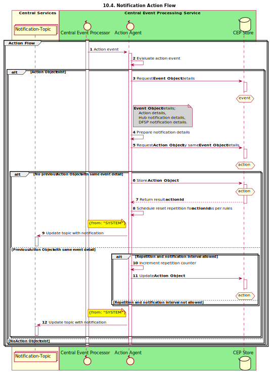

# Central Event Processor Service

[](https://github.com/mojaloop/central-event-processor/commits/master)
[](https://github.com/mojaloop/central-event-processor/releases)
[](https://hub.docker.com/r/mojaloop/central-event-processor)
[](https://circleci.com/gh/mojaloop/central-event-processor)

The Central Event Processor (CEP) service provides the capability to monitor for a pre-defined/configured set of business rules or patterns such as breaching the threshold set for a particular limit (or Net Debit Cap) or a Position Adjustment based on a Settlement.

In the current iteration, the rules are set to monitor for three criteria:

1. Breaching of a threshold on the Limit of Net Debit Cap (which may be set as part of on-boarding)
2. Adjustment of the limit - Net Debit Cap
3. Adjust of position based on a Settlement.

The CEP can then be integrated with a notifier service, to send out notifications or alerts. In this instance, it integrates with the email-notifier to send out alerts based on the aforementioned criteria.

## Contents

- [Central Event Processor Service](#central-event-processor-service)
  - [Contents](#contents)
  - [Todo](#todo)
  - [Deployment](#deployment)
  - [Notes](#notes)
  - [Tasks](#tasks)
  - [Reacts on](#reacts-on)
  - [Used technologies](#used-technologies)
  - [Local storage](#local-storage)
  - [Architecture overview](#architecture-overview)
  - [Architecture and Technologies Overview](#architecture-and-technologies-overview)
  - [General process overview](#general-process-overview)
    - [enums](#enums)
    - [Rules](#rules)
    - [Config](#config)
  - [Limit Adjustment Rules flow](#limit-adjustment-rules-flow)
  - [Limit Position Threshold Breach flow](#limit-position-threshold-breach-flow)
  - [Actions Agent flow](#actions-agent-flow)
  - [Scheduler flow](#scheduler-flow)
  - [Notifier flow (separate service)](#notifier-flow-separate-service)
  - [Auditing Dependencies](#auditing-dependencies)
  - [Container Scans](#container-scans)
  - [Automated Releases](#automated-releases)
    - [Potential problems](#potential-problems)

## Todo

- Improve code-coverage to 90% across the board: [.nycrc.yml](./.nycrc.yml). Don't forget to un-comment out the code-coverage options & rules.
- Fix `TypeError: finalizer.unsubscribe is not a function` RXJS error

## Deployment

See the [onboarding guide](onboarding.md) for running the service locally.

## Notes

- [#517 - Notification for changes to NetDebitCap or Position adjustments](https://github.com/mojaloop/project/issues/517)
- [#518 - Notification for approaching Net Debit Cap Threshold](https://github.com/mojaloop/project/issues/518)

## Tasks

- send notifications when current position breaches the limit threshold value after a successful transfer was committed
- send notifications when the limit was adjusted
- make it extendable and flexible

## Reacts on

- messages consumed from the notification topic
- data read from the central-ledger API

## Used technologies

- [RxJS](https://github.com/ReactiveX/rxjs)
- [json-rule-engine](https://github.com/cachecontrol/json-rules-engine)
- [mongoose](https://github.com/Automattic/mongoose)

## Local storage

- Mongo DB
- Mongoose is used for schema validations and ORM functions
- to set up connection the following environmental variables might be used: `CEP_DATABASE_URI` and `CEP_DATABASE_NAME`
- full database documentation can be found at [Mojaloop central notifications Database](docs/database/Mojaloop_central-notifications_Db_ver1.0.html)

## Architecture overview


[Architecture Overview](docs/images/1.png)

This is standalone service which is connected to Kafka Notification topic into the mojaloop environemnt and monitors the topic for messages which match certain rules and takes actions accordingly.

The service is developed using [RxJS](https://github.com/ReactiveX/rxjs) for observing the system and acting accordingly. The decisions for actions are taken by the [json-rule-engine](https://github.com/cachecontrol/json-rules-engine).

## Architecture and Technologies Overview


[Architecture and Technologies Overview](docs/architechDiagrams/CEPArchTechOverview.svg)

## General process overview


[Process Overview](docs/images/2.png)

The rules validations are triggered upon commited transfers. As soon as a commited transfer notification is produced from the central-ledger to the notification topic, the central-notifications service picks it up, gathers more information, runs few rules validations and acts based on rules engine outcome.

The data for performing rules validation is requested from the central-ledger admin API calls using observables, available [here](src/observables/centralLedgerAPI.js) some mapping and wiring is done through below [enums](src/lib/enum.js) properties:

### enums

```javascript
const notificationActionMap = {
  NET_DEBIT_CAP_THRESHOLD_BREACH_EMAIL: {
    enum: 'NET_DEBIT_CAP_THRESHOLD_BREACH_EMAIL',
    action: 'sendEmail',
    templateType: 'breach',
    language: 'en'
  },
  NET_DEBIT_CAP_ADJUSTMENT_EMAIL: {
    enum: 'NET_DEBIT_CAP_ADJUSTMENT_EMAIL',
    action: 'sendEmail',
    templateType: 'adjustment',
    language: 'en'
  }
}

const limitNotificationMap = {
  NET_DEBIT_CAP: {
    enum: 'NET_DEBIT_CAP',
    NET_DEBIT_CAP_THRESHOLD_BREACH_EMAIL: notificationActionMap.NET_DEBIT_CAP_THRESHOLD_BREACH_EMAIL,
    NET_DEBIT_CAP_ADJUSTMENT_EMAIL: notificationActionMap.NET_DEBIT_CAP_ADJUSTMENT_EMAIL
  }
}
```

### Rules

Currently two separate Rules are validated:

1. [Limit Adjustment Rule](src/observables/rules/ndcAdjustment.js)
2. [Limit Position Threshold Breach Rule](src/observables/rules/ndcBreach.js)

In the current implementation for each separate rule, an observable has to be created, like the couple above, and configured when and how to trigger it into the [setup](src/setup.js)
The Rules outputs should be chained to common Action Agent.

### Config

The default [config](config/config.json)

To use Environmental Variables for MongoDB URI and database name use:
`CEP_MONGO_URI` and `CEP_MONGO_DATABASE`

## Limit Adjustment Rules flow


[Limit Adjustment Rules flow](docs/sequenceDiagrams/seq-cep-10.2-adjustment-rule-validation.svg)

This rule is triggered on each limit response from the central-ledger admin API.

## Limit Position Threshold Breach flow


[Limit Position Threshold Breach flow](docs/sequenceDiagrams/seq-cep-10.3-breaching-threshold-percentage-limit.svg)

This rule is triggered when all data for the participants in the current transfer is received.

## Actions Agent flow



[Actions Agent flow](docs/sequenceDiagrams/seq-cep-10.4-action-flow.svg)

The [Action Agent](src/observables/actions) - takes care of action preparation regrding the data from central-ledger admin API and various settings.

## Scheduler flow


[Scheduler flow](docs/sequenceDiagrams/seq-cep-10.5-scheduler-flow.svg)

The scheduler coordinates the Action Object that requires to be dispatched. It would typically action a scheduled event that qualifies by insure only the prescribed number of notifications are dispatched within the set time frame defined.

## Notifier flow (separate service)


[Notifier flow](docs/images/6.png)

Email notifier service is a separate app, that observes the same topic for messages with field *from* = `SYSTEM`. Its code is available in the [email-notifier](https://github.com/mojaloop/email-notifier) repository.

## Auditing Dependencies

We use `npm-audit-resolver` along with `npm audit` to check dependencies for node vulnerabilities, and keep track of resolved dependencies with an `audit-resolve.json` file.

To start a new resolution process, run:

```bash
npm run audit:resolve
```

You can then check to see if the CI will pass based on the current dependencies with:

```bash
npm run audit:check
```

And commit the changed `audit-resolve.json` to ensure that CircleCI will build correctly.

## Container Scans

As part of our CI/CD process, we use anchore-cli to scan our built docker container for vulnerabilities upon release.

If you find your release builds are failing, refer to the [container scanning](https://github.com/mojaloop/ci-config#container-scanning) in our shared Mojaloop CI config repo. There is a good chance you simply need to update the `mojaloop-policy-generator.js` file and re-run the circleci workflow.

For more information on anchore and anchore-cli, refer to:

- [Anchore CLI](https://github.com/anchore/anchore-cli)
- [Circle Orb Registry](https://circleci.com/orbs/registry/orb/anchore/anchore-engine)

## Automated Releases

As part of our CI/CD process, we use a combination of CircleCI, standard-version
npm package and github-release CircleCI orb to automatically trigger our releases
and image builds. This process essentially mimics a manual tag and release.

On a merge to master, CircleCI is configured to use the mojaloopci github account
to push the latest generated CHANGELOG and package version number.

Once those changes are pushed, CircleCI will pull the updated master, tag and
push a release triggering another subsequent build that also publishes a docker image.

### Potential problems

- There is a case where the merge to master workflow will resolve successfully, triggering
  a release. Then that tagged release workflow subsequently failing due to the image scan,
  audit check, vulnerability check or other "live" checks.

  This will leave master without an associated published build. Fixes that require
  a new merge will essentially cause a skip in version number or require a clean up
  of the master branch to the commit before the CHANGELOG and bump.

  This may be resolved by relying solely on the previous checks of the
  merge to master workflow to assume that our tagged release is of sound quality.
  We are still mulling over this solution since catching bugs/vulnerabilities/etc earlier
  is a boon.

- It is unknown if a race condition might occur with multiple merges with master in
  quick succession, but this is a suspected edge case.
